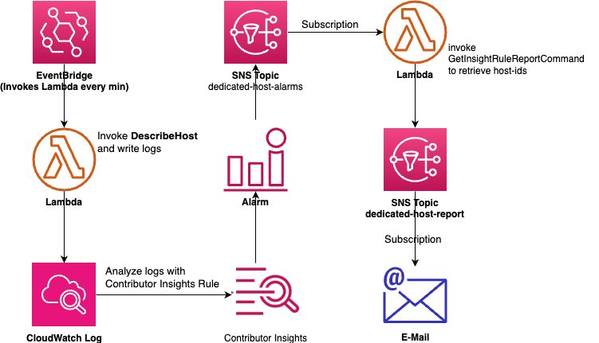
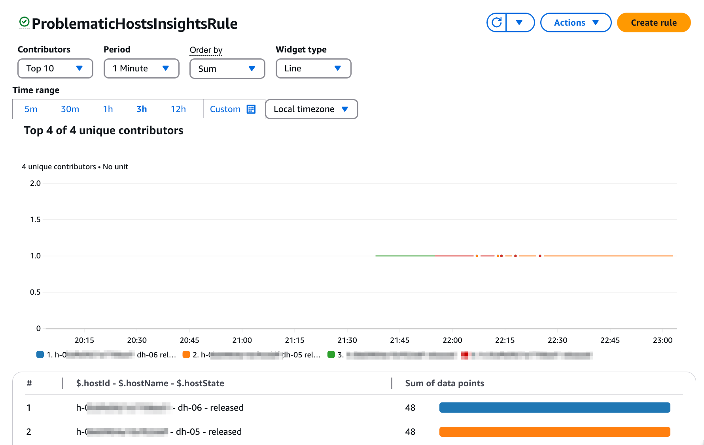
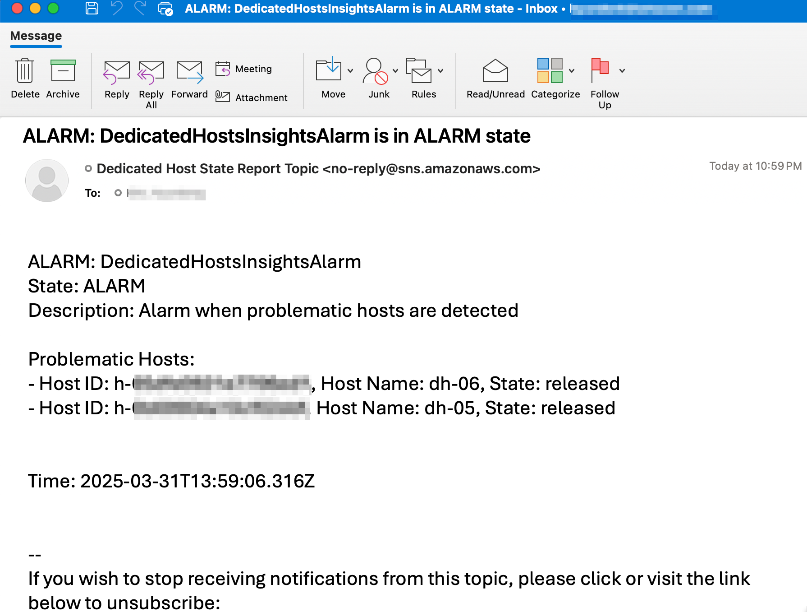

# amazon-dedicated-host-status-alarm
Configuring Alarm for Dedicated Host Status Changes with Contributor Insights

### Overview

AWS 상에서 Dedicated Host들을 운영할 때 EC2 서비스의 DescribeHosts API를 통해 Dedicated Host들의 상태를 모니터링 할 수 있습니다.

 각 Dedicated Host의 상태를 별도의 Custom Metric을 생성하여 관리하는 것은 Dedicated Host 개수가 증가함에 따라 비용 ($0.30 per metric)도 증가하고 관리 비용도 증가하게 됩니다. 각 Dedicated Host별로 metric을 만드는 대신, dimension을 명시하지 않고 모든 Host에 대해 통합하여 하나의 custom metric을 생성하여 전체 Dedicated Host에 대해 하나의 Metric으로 관리를 할 수도 있지만 이 경우 상태가 변경되면 어느 Dedicated Host에 문제가 있는지는 바로 확인할 수 없는 문제가 있습니다. 

CloudWatch Contributor Insights는 이러한 다수의 고유한 element (e.g. Host ID)들이 있는 환경(High Cardinality)에서 하나의 Contributor Rule에 의해 다수의 Host에 대해 영향을 한눈에 파악할 수 있는 기능을 제공합니다. 

본 예제에서는 아래 그림의 구성으로 Dedicated Host들의 상태를 모니터링하는 시스템을 구성합니다. 




### 동작 방식

1. EventBridge: 매 분마다 DescribeHost Lambda 함수를 호출합니다.

2. 'DescribeHost' Lambda function:  EC2 DescribeHosts API를 호출하여 Dedicated Host들의 상태를 check하여 상태 정보를 CloudWatch Log에 남깁니다. ('under-assessment', 'permanent-failure', 'released', 'released-permanent-failure' 상태인지를 check합니다. )

3. Contributor Insights는 CloudWatch Log를 분석하여 어떤 Host의 상태 로그가 많이 발생했는지를 알아내고 이를 도시합니다. 
4. CloudWatch Alarm을 통해 Contributor Insights에서 Unique Contributor를 인지하면 'dedicated-host-alarms' SNS topic으로 Alarm을 보냅니다.
5. 해당 topic에 subscription되어 있는 'process-alarm' lambda 함수가 호출되고 해당 lambda 함수는 'dedicated-host-report' SNS Topic을 통해 해당 Topic에 subscription되어 있는 이메일 주소로 이메일을 전송합니다. 


### 구현

1/ Lambda 함수 코드는 아래 GitHub Repository에서 다운 받을 수 있습니다.

```
git clone https://github.com/hyundonk/amazon-dedicated-host-status-alarm.git
```

2/ 'DescribeHost' Lamba 함수 생성

```bash
DESCRIBE_HOSTS_FUNCTION_NAME=DescribeHosts

cat > trust-policy.json << EOF
{
  "Version": "2012-10-17",
  "Statement": [
    {
      "Effect": "Allow",
      "Principal": {
        "Service": "lambda.amazonaws.com"
      },
      "Action": "sts:AssumeRole"
    }
  ]
}
EOF

DescribeHostsRole_ARN=$(aws iam create-role \
    --role-name DescribeHostsRole \
    --assume-role-policy-document file://trust-policy.json \
    --query 'Role.Arn' \
    --output text)
    

cat > role-policy.json << EOF
{
    "Version": "2012-10-17",
    "Statement": [
        {
            "Effect": "Allow",
            "Action": [
                "ec2:DescribeHosts"
            ],
            "Resource": "*"
        },
        {
            "Effect": "Allow",
            "Action": [
                "logs:CreateLogGroup",
                "logs:CreateLogStream",
                "logs:PutLogEvents"
            ],
            "Resource": "arn:aws:logs:*:*:*"
        }
    ]
}
EOF

aws iam create-policy \
    --policy-name DescribeHostsPolicy \
    --policy-document file://role-policy.json

aws iam attach-role-policy \
    --role-name DescribeHostsRole \
    --policy-arn $(aws iam list-policies --query 'Policies[?PolicyName==`DescribeHostsPolicy`].Arn' --output text)

zip -r function.zip describe-hosts.js 

aws lambda create-function \
    --function-name $DESCRIBE_HOSTS_FUNCTION_NAME \
    --runtime nodejs22.x \
    --handler describe-hosts.handler \
    --role $DescribeHostsRole_ARN \
    --zip-file fileb://function.zip
    
```


3/ 매분 'DescribeHost' Lambda 함수를 호출하기 위한 EventBridge Rule 생성

```bash
# Create an EventBridge schedule rule that runs every minute
EVENTBRIDGE_RULE_NAME=DescribeHostsScheduleRule
aws events put-rule \
    --name $EVENTBRIDGE_RULE_NAME \
    --schedule-expression "rate(1 minute)" \
    --state ENABLED
    
# Add permission to allow EventBridge to invoke the Lambda function
aws lambda add-permission \
    --function-name DescribeHosts \
    --statement-id EventBridgeInvoke \
    --action lambda:InvokeFunction \
    --principal events.amazonaws.com \
    --source-arn $(aws events describe-rule --name $EVENTBRIDGE_RULE_NAME --query 'Arn' --output text)
    
# Add the Lambda function as a target for the EventBridge rule
aws events put-targets \
    --rule $EVENTBRIDGE_RULE_NAME \
    --targets "Id"="1","Arn"="$(aws lambda get-function --function-name $DESCRIBE_HOSTS_FUNCTION_NAME --query 'Configuration.FunctionArn' --output text)"
```


4/ Contributor Insights Rule 생성

```bash
# Create a contributor insights rule
CONTRIBUTOR_INSIGHTS_RULE_NAME=ProblematicHostsInsightsRule
aws cloudwatch put-insight-rule \
    --rule-name $CONTRIBUTOR_INSIGHTS_RULE_NAME \
    --rule-state ENABLED \
    --rule-definition '{

  "Schema": {
    "Name": "CloudWatchLogRule",
    "Version": 1
  },
  "LogGroupNames": [
    "/aws/lambda/DescribeHosts"
  ],
  "LogFormat": "JSON",
  "Contribution": {
    "Keys": ["$.hostId", "$.hostName", "$.hostState"],
    "Filters": [
      {
        "Match": "$.event_type",
        "In": ["PROBLEMATIC_HOST"]
      },
      {
        "Match": "$.hostState",
        "In": ["released", "under-assessment", "permanent-failure", "released-permanent-failure"]
      }
    ]
  },
  "AggregateOn": "Count",
  "ValueOf": "1"
}'
```


5/ 'dedicated-host-alarms' SNS Topic 생성

```bash
# Create SNS dedicated-host-alarms Topic. ProcessAlarm Lambda function will subscribe to this topic
DedicatedHostAlarmTopic=$(aws sns create-topic --name dedicated-host-alarms --attributes DisplayName="Dedicated Host State Alarm Topic" --output text --query 'TopicArn')

```


6/ 'dedicated-host-report' SNS topic 생성하고 E-Mail 주소를 해당 topic에 구독 추가

```bash
# Create SNS dedicated-host-report Topic. Email subscription will be added to this topic
DedicatedHostReportTopic=$(aws sns create-topic --name dedicated-host-report --attributes DisplayName="Dedicated Host State Report Topic" --output text --query 'TopicArn')

aws sns subscribe \
    --topic-arn $DedicatedHostReportTopic \
    --protocol email \
    --notification-endpoint hyundonk@amazon.com
    
```

7/ 'process-alarm' lambda function 생성

```bash
cd ../lambda/process-alarm/
zip -r function.zip process-alarm.js

# Create a IAM role for process-alarm
cat > trust-policy.json << EOF
{
  "Version": "2012-10-17",
  "Statement": [
    {
      "Effect": "Allow",
      "Principal": {
        "Service": "lambda.amazonaws.com"
      },
      "Action": "sts:AssumeRole"
    }
  ]
}
EOF

ProcessAlarmRole_ARN=$(aws iam create-role \
    --role-name ProcessAlarmRole \
    --assume-role-policy-document file://trust-policy.json \
    --query 'Role.Arn' \
    --output text)
    

cat > role-policy.json << EOF
{
    "Version": "2012-10-17",
    "Statement": [
        {
            "Effect": "Allow",
            "Action": [
                "cloudwatch:GetInsightRuleReport"
            ],
            "Resource": [
                "arn:aws:cloudwatch:*:*:insight-rule/$CONTRIBUTOR_INSIGHTS_RULE_NAME"
            ]
        },
        {
            "Effect": "Allow",
            "Action": [
                "sns:Publish"
            ],
            "Resource": [
                "${DedicatedHostReportTopic}"
            ]
        },
        {
            "Effect": "Allow",
            "Action": [
                "logs:CreateLogGroup",
                "logs:CreateLogStream",
                "logs:PutLogEvents"
            ],
            "Resource": "arn:aws:logs:*:*:*"
        }
    ]
}
EOF

aws iam create-policy \
    --policy-name ProcessAlarmPolicy \
    --policy-document file://role-policy.json

aws iam attach-role-policy \
    --role-name ProcessAlarmRole \
    --policy-arn $(aws iam list-policies --query 'Policies[?PolicyName==`ProcessAlarmPolicy`].Arn' --output text)
    

aws lambda create-function \
  --function-name ProcessAlarm \
  --zip-file fileb://function.zip \
  --handler process-alarm.handler \
  --runtime nodejs22.x \
  --role arn:aws:iam::111122223333:role/ProcessAlarmRole \
  --timeout 10 \
  --environment "Variables={SNS_TOPIC_ARN=$DedicatedHostReportTopic,CONTRIBUTOR_INSIGHTS_RULE_NAME=$CONTRIBUTOR_INSIGHTS_RULE_NAME}"

# Give DedicatedHostAlarmTopic Topic to invoke ProcessAlarm Lambda function
aws lambda add-permission \
    --function-name ProcessAlarm \
    --statement-id SNSInvoke \
    --action lambda:InvokeFunction \
    --principal sns.amazonaws.com \
    --source-arn $DedicatedHostAlarmTopic
    
```


9/ 위 'process-alarm' lambda 함수를  dedicated-host-alarms topic의 구독으로 추가

```bash
# subscribe lambda function as notification endpoint of the SNS topic
aws sns subscribe \
    --topic-arn $DedicatedHostAlarmTopic \
    --protocol lambda \
    --notification-endpoint $(aws lambda get-function --function-name ProcessAlarm --query 'Configuration.FunctionArn' --output text)
```

10/ Metric Alarm 생성 (Math Expression)

```bash
aws cloudwatch put-metric-alarm \
  --alarm-name "DedicatedHostsInsightsAlarm" \
  --alarm-description "Alarm when problematic hosts are detected" \
  --evaluation-periods 2 \
  --datapoints-to-alarm 1 \
  --threshold 0 \
  --comparison-operator GreaterThanThreshold \
  --treat-missing-data notBreaching \
  --metrics '[{
    "Id": "m1",
    "Expression": "INSIGHT_RULE_METRIC(\"ProblematicHostsInsightsRule\", \"UniqueContributors\")",
    "Label": "ProblematicHostsInsightsRule UniqueContributors",
    "ReturnData": true,
    "Period": 60
  }]' \
  --alarm-actions $DedicatedHostAlarmTopic
```


### Demo screenshots

Contributor Insights - Top unique contributors



Sample Alarm E-Mail




